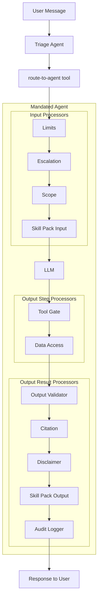

# Architecture & Reference

OpenMandate is a governance framework for AI agents. It enforces declarative YAML policies at runtime through a chain of processors that gate every tool call, validate every output, and log every interaction.

Built on [Mastra](https://mastra.ai). Domain expertise is delivered through pluggable [Skill Packs](./building-skills.md).

---

## Design Principles

1. **Whitelist model** — Tools not in the mandate are never exposed to the agent
2. **Declarative governance** — Everything an agent can/cannot do is declared in YAML, not scattered across code
3. **Defense in depth** — Multiple overlapping processors enforce rules at different points in the lifecycle
4. **Domain-agnostic core** — The framework knows nothing about law, healthcare, etc. — skill packs bring the expertise
5. **Audit everything** — Every interaction is logged to SQLite for compliance

---

## Architecture



### Component Map

| Layer | Location | Purpose |
|---|---|---|
| **Mandate Schema** | `src/mandate/schema.ts` | Zod schema defining the YAML structure |
| **Parser** | `src/mandate/parser.ts` | Reads and validates YAML files |
| **Validator** | `src/mandate/validator.ts` | Logical consistency checks |
| **System Prompt Builder** | `src/mandate/system-prompt-builder.ts` | Builds agent instructions from mandate + skill fragments |
| **Tool Filter** | `src/mandate/tool-filter.ts` | Whitelist filter for tools |
| **Processors** | `src/mandate/processors/` | 9 core enforcement processors |
| **Agent Factory** | `src/mastra/agents/factory.ts` | Assembles Mastra Agent with full processor wiring |
| **Agent Registry** | `src/mastra/agents/agent-registry.ts` | Tracks mandated agents for triage routing |
| **Triage Agent** | `src/mastra/agents/triage.ts` | LLM-powered intent classifier and router |
| **Skill Registry** | `src/skills/registry.ts` | Central store for loaded skill packs |
| **Skill Loader** | `src/skills/loader.ts` | Resolves skill packs from npm or local paths |
| **Audit Logger** | `src/audit/logger.ts` | SQLite-backed compliance logging |
| **Bridges** | `src/bridges/` | Messaging platform adapters (CLI, Telegram, Discord) |
| **CLI** | `src/cli/index.ts` | `validate`, `inspect`, `audit` commands |

---

## Mandate YAML Reference

A mandate is a declarative YAML file that defines everything an agent can and cannot do. The full schema is in `src/mandate/schema.ts`.

### `version`

```yaml
version: "1.0"
```

Schema version. Currently always `"1.0"`.

### `metadata`

```yaml
metadata:
  name: "tenant-rights-eaw"                    # Unique agent identifier
  description: "Tenant rights assistant..."     # Human-readable description
  author: "openmandate"                         # Author/org
  created: "2026-02-18"                         # Creation date
  tags: ["housing", "tenancy"]                  # Searchable tags
  skill_packs:                                  # Required skill packs
    - "uk-law"
```

### `capabilities`

```yaml
capabilities:
  tools:                        # Whitelist — only these tools are exposed
    - "formal-letter"
    - "legislation-lookup"
  data_access:                  # File type + permission rules
    - scope: "user_uploads"
      permissions: ["read"]           # "read" | "write"
      file_types: [".pdf", ".docx"]   # Optional extension filter
    - scope: "agent_memory"
      permissions: ["read", "write"]
  output_types:                 # Declared output categories
    - "formal_letter"
    - "rights_summary"
```

| Field | Type | Enforced By |
|---|---|---|
| `tools` | `string[]` | Tool Gate processor — blocks any tool not in the list |
| `data_access[].permissions` | `("read" \| "write")[]` | Data Access processor — blocks writes when only read is allowed |
| `data_access[].file_types` | `string[]` | Data Access processor — blocks files with unlisted extensions |
| `output_types` | `string[]` | Informational (used by system prompt) |

### `prohibitions`

```yaml
prohibitions:
  tools:                        # Explicitly banned tools (supports wildcards)
    - "shell-execute"
    - "payment-*"               # Wildcard — blocks payment-send, payment-refund, etc.
  actions:                      # Prohibited behaviours (matched by regex patterns)
    - "provide_legal_advice"
    - "represent_as_solicitor"
  data:                         # Data categories the agent must never handle
    - "financial_accounts"
    - "medical_records"
```

| Field | Enforced By |
|---|---|
| `tools` | Tool Gate processor — blocks even if somehow exposed |
| `actions` | Output Validator processor — regex patterns registered via `setup()` |
| `data` | System prompt injection (advisory) |

### `requirements`

#### `disclaimers`

```yaml
requirements:
  disclaimers:
    - trigger: "always"                          # always | on_document_generation | on_legal_claim | on_claim | custom
      text: "This is not legal advice..."
      placement: "end"                           # start | end | both
    - trigger: "custom"
      text: "AI-generated document — review before use."
      placement: "start"
      custom_pattern: "DRAFT|LETTER BEFORE ACTION"   # Regex for custom trigger
```

Enforced by the **Disclaimer processor**, which scans the output and appends/prepends matching disclaimer text.

#### `citations`

```yaml
  citations:
    required: true
    format: "inline"                    # inline | footnote | end
    min_per_claim: 1
    allowed_sources:
      - "uk_primary_legislation"
      - "case_law"
    blocked_sources:
      - "wikipedia"
      - "reddit"
```

Enforced by the **Citation processor**:
- Blocks substantive responses (>200 chars) that lack citation patterns (legislation refs, case law, URLs)
- Blocks any mention of blocked sources
- Uses `abort({ retry: true })` to ask the LLM to add citations

#### `human_review`

```yaml
  human_review:
    required_before:
      - "finalize_document"
      - "provide_deadline"
    review_prompt: "Please review this draft carefully before using it."
```

Enforced by the **Disclaimer processor** — when output matches `required_before` patterns (document generation, deadline mentions), the `review_prompt` is appended.

#### `audit`

```yaml
  audit:
    log_level: "full"               # full | actions_only | errors_only
    include_llm_calls: true
    include_tool_calls: true
    retention_days: 90
```

Configures the **Audit processor** and `AuditLogger`.

### `scope`

```yaml
scope:
  allowed: ["GB-EAW"]                          # Jurisdiction/domain codes
  behavior_on_unsupported: "escalate"          # escalate | refuse | warn_and_attempt
  escalation_message: "I only cover England & Wales law..."
```

Enforced by the **Scope processor** — detects jurisdiction keywords in user input and blocks/redirects unsupported scopes.

### `escalation`

```yaml
escalation:
  triggers:
    - condition: "topic_match"
      topics: ["criminal_defence", "immigration_asylum"]
      action: "refuse_and_redirect"            # warn_user | refuse_and_redirect | provide_resources | refuse
      message: "This topic requires specialist advice."
      resources:
        - "Citizens Advice: https://www.citizensadvice.org.uk"

    - condition: "user_distress_detected"
      action: "provide_resources"
      message: "It sounds like you're going through a difficult time."
      resources:
        - "Samaritans: 116 123"
```

Enforced by the **Escalation processor** — matches topic keywords and distress signals in user input.

### `limits`

```yaml
limits:
  max_tokens_per_turn: 8000        # Output truncated beyond this
  max_tool_calls_per_turn: 10      # Tool gate blocks excess calls
  max_turns_per_session: 100       # Input blocked after limit
  max_concurrent_sessions: 5       # Input blocked when exceeded
  token_budget_daily: 500000       # Daily aggregate limit
  timeout_seconds: 120             # Per-turn timeout
```

Enforced by the **Limits processor** — tracks turns per session, estimates token counts, and enforces daily budgets.

---

## Processor Chain

The framework ships 9 core processors, executed in a strict order:

### Input Processors (Before LLM)

| Order | Processor | File | Purpose |
|---|---|---|---|
| 1 | **Limits** | `limits.processor.ts` | Rate limits, session tracking, daily budgets |
| 2 | **Escalation** | `escalation.processor.ts` | Topic detection, distress signals |
| 3 | **Scope** | `scope.processor.ts` | Jurisdiction/domain validation |
| 4+ | **Skill Pack** | (varies) | Domain-specific input checks |

### Output Step Processors (Per LLM Step)

| Order | Processor | File | Purpose |
|---|---|---|---|
| 1 | **Tool Gate** | `tool-gate.processor.ts` | Block prohibited/unlisted tool calls |
| 2 | **Data Access** | `data-access.processor.ts` | File type + write restrictions |

### Output Result Processors (After Final Response)

| Order | Processor | File | Purpose |
|---|---|---|---|
| 1 | **Output Validator** | `output-validator.processor.ts` | Block prohibited action language |
| 2 | **Citation** | `citation.processor.ts` | Enforce citation requirements |
| 3 | **Disclaimer** | `disclaimer.processor.ts` | Append disclaimers + human review prompts |
| 4+ | **Skill Pack** | (varies) | Domain-specific output checks |
| Last | **Audit** | `audit.processor.ts` | Log everything to SQLite |

---

## Agent Factory

The `createMandatedAgent()` function in `src/mastra/agents/factory.ts` is the central assembly point. It:

1. **Parses** the mandate YAML and validates against the Zod schema
2. **Verifies** all required skill packs are registered
3. **Aggregates** tools from all skill packs, then filters by the mandate's whitelist
4. **Builds** the system prompt from mandate rules + skill pack fragments
5. **Assembles** the processor chain (core + skill pack processors)
6. **Returns** a standard Mastra `Agent` with `inputProcessors` and `outputProcessors` wired

```typescript
import { createMandatedAgent } from "./mastra/agents/factory.js";

const agent = createMandatedAgent({
    mandatePath: "./packages/skill-uk-law/mandates/tenant-rights-eaw.mandate.yaml",
    model: "anthropic:claude-sonnet-4-5-20250929",
    skillRegistry: registry,
    description: "Helps tenants understand their rights...",
    auditDbPath: "./data/audit/audit.db",  // optional
});
```

---

## Triage Agent

The triage agent is a lightweight router that classifies user intent and hands off to the right mandated agent. It has **no mandate** — it's pure routing.

### How It Works

1. User message arrives at the triage agent
2. The triage agent's system prompt lists all available specialist agents (from `AgentRegistry`)
3. The LLM classifies intent and calls the `route-to-agent` tool
4. The tool calls `agent.generate()` on the target mandated agent
5. The target agent's response (with full mandate enforcement) is returned

If intent is ambiguous, the triage agent asks **one** clarifying question before routing.

### Usage

```typescript
import { AgentRegistry } from "./mastra/agents/agent-registry.js";
import { createTriageAgent } from "./mastra/agents/triage.js";

// Register agents
const agentRegistry = new AgentRegistry();
agentRegistry.register({
    id: "tenant-rights-eaw",
    description: "Helps tenants with housing rights in E&W...",
    mandateName: "tenant-rights-eaw",
    tags: ["housing", "tenancy", "landlord"],
    agent: tenantRightsAgent,
});

// Create triage entry point
const triageAgent = createTriageAgent({
    agentRegistry,
    model: "anthropic:claude-sonnet-4-5-20250929",
});
```

### Example Flow

```
User: "I'm needing help with my landlord"
  → Triage LLM identifies: housing/tenancy issue
  → Calls route-to-agent("tenant-rights-eaw", "I'm needing help with my landlord")
  → tenant-rights-eaw agent responds with mandate-enforced answer
  → Response includes disclaimer, citations, etc.
```

---

## Messaging Bridges

Bridges connect agents to messaging platforms. All bridges implement the `Bridge` interface:

```typescript
interface BridgeMessage {
    platform: string;
    userId: string;
    threadId: string;
    text: string;
    timestamp: string;
}

interface Bridge {
    platform: string;
    start(): Promise<void>;
    stop(): Promise<void>;
    onMessage(handler: (msg: BridgeMessage) => Promise<string>): void;
}
```

### Available Bridges

| Bridge | File | Config |
|---|---|---|
| **CLI** | `src/bridges/cli.ts` | None — runs in terminal |
| **Telegram** | `src/bridges/telegram.ts` | `TELEGRAM_BOT_TOKEN` |
| **Discord** | `src/bridges/discord.ts` | `DISCORD_TOKEN` |

Bridges handle platform-specific concerns (message splitting, formatting) and route messages through the agent's `generate()` method.

---

## CLI Reference

The CLI (`src/cli/index.ts`) provides three commands:

### `validate`

Validates a mandate YAML file against the schema and checks logical consistency.

```bash
npx tsx src/cli/index.ts validate ./packages/skill-uk-law/mandates/tenant-rights-eaw.mandate.yaml
```

Output:
```
✅ Schema validation passed
  Name: tenant-rights-eaw
  Tools: formal-letter, legislation-lookup, deadline-calculator, case-law-search
  Skill packs: uk-law
  Scope: GB-EAW
✅ Logical consistency check passed
```

Consistency checks include:
- Tools listed in both `capabilities.tools` and `prohibitions.tools`
- Empty tool lists
- Overlapping data access scope permissions

### `inspect`

Shows a human-readable summary of what an agent can and cannot do.

```bash
npx tsx src/cli/index.ts inspect ./packages/skill-uk-law/mandates/tenant-rights-eaw.mandate.yaml
```

### `audit`

Queries the SQLite audit log.

```bash
# View recent entries
npx tsx src/cli/index.ts audit -n 20

# Filter by status
npx tsx src/cli/index.ts audit --status blocked

# Filter by agent
npx tsx src/cli/index.ts audit --agent tenant-rights-eaw

# Show stats
npx tsx src/cli/index.ts audit --stats

# Custom database path
npx tsx src/cli/index.ts audit -d ./data/audit/audit.db
```

---

## Audit System

Every agent interaction is logged to SQLite via the `AuditLogger` (`src/audit/logger.ts`).

### Database Schema

```sql
CREATE TABLE audit_log (
    id INTEGER PRIMARY KEY AUTOINCREMENT,
    timestamp TEXT NOT NULL,
    mandate_name TEXT NOT NULL,
    mandate_version TEXT DEFAULT '1.0',
    status TEXT NOT NULL,           -- success | blocked | escalated | error
    input_text TEXT,
    output_text TEXT,
    check_name TEXT,                -- Which processor triggered
    check_result TEXT,
    check_detail TEXT,              -- Reason for block/escalation
    tool_calls TEXT,                -- JSON of tool calls made
    error TEXT,
    created_at DATETIME DEFAULT CURRENT_TIMESTAMP
);
```

### Programmatic Access

```typescript
import { AuditLogger } from "./audit/logger.js";

const logger = new AuditLogger("./data/audit/audit.db");

// Query
const blocked = logger.query({ status: "blocked", limit: 10 });

// Stats
const stats = logger.stats("tenant-rights-eaw");
// → { total: 150, blocked: 3, escalated: 7, errors: 0 }

logger.close();
```

---

## Environment Variables

Copy `.env.example` to `.env` and configure:

```bash
# === LLM Provider Keys (at least one required) ===
ANTHROPIC_API_KEY=sk-ant-...
OPENAI_API_KEY=sk-...

# === Messaging Bridges (optional) ===
TELEGRAM_BOT_TOKEN=
DISCORD_TOKEN=

# === Database (optional — defaults to local SQLite) ===
# AUDIT_DB_PATH=./data/audit/audit.db
# MEMORY_DB_PATH=./data/memory/memory.db
```

---

## Testing

The project uses **Vitest** for testing. Tests live alongside the code in `__tests__/` directories.

### Test Suites

| Suite | File | Tests | Covers |
|---|---|---|---|
| Parser | `mandate/__tests__/parser.test.ts` | 17 | YAML parsing, metadata extraction |
| Validator | `mandate/__tests__/validator.test.ts` | 9 | Logical consistency checks |
| System Prompt | `mandate/__tests__/system-prompt-builder.test.ts` | 9 | Prompt generation |
| Processors | `mandate/__tests__/processors.test.ts` | 14 | Core processor behaviour |
| Enforcement | `mandate/__tests__/enforcement.test.ts` | 20 | New processors: data-access, citation, limits, human review |
| Composer | `mandate/__tests__/composer.test.ts` | 8 | Mandate composition |
| Tool Filter | `mandate/__tests__/tool-filter.test.ts` | 6 | Whitelist filtering |
| Skill Registry | `skills/__tests__/registry.test.ts` | 11 | Registration, collision detection |
| Triage | `mastra/__tests__/triage.test.ts` | 12 | Agent registry, triage routing, error handling |

### Running Tests

```bash
npx vitest run              # All tests (106 total)
npx vitest run -t "Scope"   # Filter by name
npx vitest --watch           # Watch mode
npx tsc --noEmit             # Type check (no emit)
```

---

## Quick Start

```bash
# 1. Clone and install
git clone https://github.com/ryanmcdonough/openmandate.git
cd openmandate
npm install

# 2. Configure
cp .env.example .env
# Add your ANTHROPIC_API_KEY or OPENAI_API_KEY

# 3. Validate a mandate
npx tsx src/cli/index.ts validate ./packages/skill-uk-law/mandates/tenant-rights-eaw.mandate.yaml

# 4. Inspect agent permissions
npx tsx src/cli/index.ts inspect ./packages/skill-uk-law/mandates/tenant-rights-eaw.mandate.yaml

# 5. Start development server
npm run dev

# 6. Run tests
npx vitest run
```
